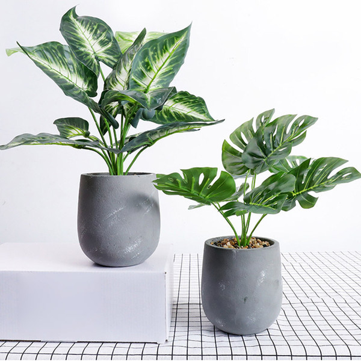

#  “The purpose of our lives is to be happy.” — Dalai Lama
---
Hi. My name is Nurina Aziemah and I’m majoring Web development, currently in my 3rd year, at one of the prestigious colleges in Brunei Darussalam. 

My experience in computer field during my second half high school years, in which I took Computer Science as my optional subject, made me realized how fun it is to code and figuring out which chord fits best into a progression. It is interesting to see that they are different programming languages in the programming world, when they in fact function the same way as others. Designing is also my passion, especially in regards to website. I love the feelings of the satisfaction after viewing the completed website that I designed by myself. At some point in the future, I would like to contribute to the society in the IT industry. 

I volunteered at a charity organization committed to providing education for the children with disability, as a way for me to offer assistance and care for individuals, and also improve the society, especially in the modern world. as well as to improve my communication skills which could help me in the future that might be able to help in achieving my goals. However, my goals for the moment is to focus on my study and be able to graduate with high qualifications. In addition, I aspire to improve what I have been lacking in regards to both my education and myself. 
